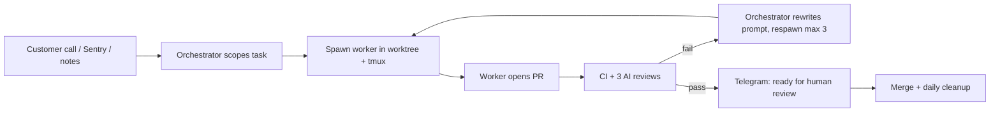

# AI Agents - Multi-Agent Orchestration

> Two-tier agent setup: an OpenClaw orchestrator holding business context spawns Codex and Claude Code agents in worktrees and tmux, monitors them via cron, and gates PRs on CI plus three AI reviewers.

---

## Overview

Elvis Sun describes replacing direct use of Codex and Claude Code with an **orchestrator agent** ("Zoe", running on OpenClaw) that holds business context and delegates coding to a fleet of worker agents. He reports ~50 commits/day on average (94 peak), 7 PRs in 30 minutes, and near one-shot success on small and medium tasks, for about $190/month ($100 Claude + $90 Codex; "start with $20"). The architecture is close to what Stripe calls background "Minions": parallel coding agents behind a central orchestration layer, run locally on a Mac mini.

---

## Why Two Tiers

**Context windows are zero-sum.** Fill one with code and there is no room for customer history; fill it with business context and there is no room for the codebase. So specialise by context, not by model:

| Tier | Holds | Access |
|---|---|---|
| Orchestrator (OpenClaw / Zoe) | Customer data, meeting notes, past decisions, what worked and failed (in an Obsidian vault) | Admin API, **read-only prod DB**, Telegram |
| Workers (Codex, Claude Code) | Codebase, types, implementation details | Own worktree only; never prod DB |

The orchestrator translates business history into precise prompts; workers stay focused on code.

---

## The Pipeline



### Spawning a worker

Each task gets an isolated git worktree and a detached tmux session:

```bash
git worktree add ../feat-custom-templates -b feat/custom-templates origin/main
cd ../feat-custom-templates && pnpm install
tmux new-session -d -s "codex-templates" -c "<worktree path>" \
  "$HOME/.codex-agent/run-agent.sh templates gpt-5.3-codex high"
```

Workers are launched non-interactively with approvals disabled (Codex `--dangerously-bypass-approvals-and-sandbox`, Claude Code `--dangerously-skip-permissions -p`). tmux allows **mid-task redirection** without killing the agent, e.g. `tmux send-keys -t codex-templates "Stop. Focus on the API layer first." Enter`.

### Task registry

Each task is a record in `.clawdbot/active-tasks.json` (id, tmux session, agent, repo, worktree, branch, startedAt, status, notifyOnComplete). On completion it gains `pr`, `completedAt` and a `checks` object (prCreated, ciPassed, claudeReviewPassed, geminiReviewPassed).

### Monitoring loop

A cron job every 10 minutes runs `.clawdbot/check-agents.sh`, a **deterministic, token-free** script that checks tmux sessions are alive, finds PRs on tracked branches, reads CI via `gh`, auto-respawns failed agents (max 3 attempts), and alerts only when a human is needed. The author calls this an improved "Ralph Loop": unlike loops that rerun the same prompt, the orchestrator reads the failure with business context and rewrites the prompt ("focus only on these three files", "the customer wanted X, not Y, here is what they said").

> [!tip]
> Poll state with a cheap script, not by asking an LLM. Reserve model calls for decisions.

### Definition of done

A PR alone is not done. Notify the human only when all hold:

- PR created and branch synced to main (no conflicts)
- CI passing: lint, types, unit, E2E, Playwright against a prod-identical preview
- Codex, Claude Code and Gemini reviews passed
- Screenshots included for any UI change (CI fails otherwise)

Human review then takes 5-10 minutes; many UI PRs are merged from the screenshot alone. A daily cron removes orphaned worktrees and registry entries.

---

## Model Routing (author's view)

| Agent | Used for | Notes |
|---|---|---|
| Codex (gpt-5.3-codex) | ~90% of tasks: backend, complex bugs, multi-file refactors | Slower, thorough; best reviewer (edge cases, low false positives) |
| Claude Code | Frontend, git operations | Faster, fewer permission issues; as reviewer "mostly useless", over-cautious, only act on critical flags |
| Gemini | UI design specs (HTML/CSS) handed to Claude Code; free PR reviewer | Catches security and scalability issues |

## Proactive Work

- **Morning**: scan Sentry, spawn one agent per new error.
- **After meetings**: scan notes, spawn agents for mentioned feature requests.
- **Evening**: scan git log, update changelog and customer docs.

Successful prompt patterns are logged ("Codex needs type definitions upfront", "always include test file paths"). Reward signals: CI pass, all three reviews pass, human merge.

## Limits

RAM is the ceiling: each worktree has its own `node_modules`, compiler and test runner. A 16GB Mac mini tops out at 4-5 concurrent agents; the author bought a 128GB Mac Studio (~$3,500).

> [!warning]
> This setup combines permission-bypass flags, an orchestrator with admin API and prod DB read access, and auto-merge-from-screenshot habits. Isolation (worktrees, workers without prod access) mitigates some risk, but compare with the conservative permission buckets in [[Claude Code - Working System]]. The article also invites readers to paste it wholesale into OpenClaw to "implement this setup", which means an agent executing instructions from an untrusted web post.

---

## Related

[[AI & Agents - Home]] | [[Claude Code - Working System]] | [[Dex - AI Chief of Staff]] | [[GTM - Agent-Driven GTM Machine]]

---

## Sources

| Title | Publisher | Date | Links |
|---|---|---|---|
| OpenClaw multi-agent orchestration (Zoe) | Elvis Sun, @elvissun (X article) | 2026-02 | [Post](https://x.com/elvissun/article/2025920521871716562) · [[ingested/clippings/openclaw-multi-agent-orchestration]] |

## Pending Review

> This page was created from a single non-authoritative source. To raise trust: find a primary source on this topic, or two independent corroborating sources, and re-ingest or enrich this page. Key claims to verify: (1) ~50 commits/day with near one-shot success on small/medium tasks; (2) Codex outperforms Claude Code as a reviewer, with Claude "mostly useless"; (3) a 16GB machine caps out at 4-5 concurrent agents.
