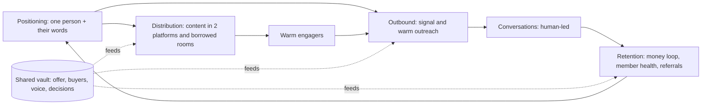

# Growth & Sales - Home

*Domain hub for sales, marketing, go-to-market and early distribution: outbound outreach, audience-first product marketing, agent-driven GTM workflows, zero-ad-spend user acquisition and e-commerce basics.*

**Scope:** How a solo operator or small team finds customers, talks to them and keeps them: positioning, content distribution, outbound, GTM automation and retention. Search-engine technique lives in [[SEO - Home]], and agent tooling in general lives in [[AI & Agents - Home]].

---

## Bootstrap

*Read these before doing substantive work in this domain.*

**Mandatory reads:**

1. [[Marketing - How to Sell a Product]] - The audience-first method (one person, their words, packaging first). Every other page assumes it
2. [[GTM - Agent-Driven GTM Machine]] - The operating model: a shared vault, workflows shaped as trigger/source/output/approval, and build order by business type

**Read situationally** (use the Pages table for lookup):
- [[Sales - Outbound Outreach]] - Before any LinkedIn or email prospecting, or before setting up an outreach agent
- [[Growth - First Users Without Ad Spend]] - Launching a new product with no budget, or choosing B2C app niches and pricing
- [[E-commerce - Foundations]] - Starting an online store (stub)

**If no filesystem tool:** Work from chat context and ask for the pages you need to be pasted in.

---

## Cross-Cutting Principles

All the sources in this domain are practitioner threads, and they agree to a large degree:

| # | Principle | Where it shows up |
|---|---|---|
| 1 | **Start from one specific person.** The niche decides the platform, the words and often the product | Sell-a-product profile; the outreach client filter; the GTM "buyers" note; cult-like audiences as a niche predictor |
| 2 | **Research is the product, and sending is a formality.** A specific hook about the prospect beats volume | "No hook, no message"; signal outbound; competitor 1-star review DMs |
| 3 | **Help before you pitch.** Value first, product last, soft asks | 80/20 Reddit posts; reverse cold email; micro-commitment CTAs; "sell at the end" |
| 4 | **Go where buyers already are, and borrow rooms before buying reach** | Pick 2 platforms; 5-10 communities; borrowed rooms; competitor placements |
| 5 | **Humans approve anything that sends, spends or prices.** Agents research and draft | Outreach agent guardrails; the GTM approval rule; manual DMs because platforms ban automation |
| 6 | **Small, capped volume and one thing at a time** | 5-10 sends/day; weekly caps; one workflow at a time (the 7am test); pick 3 channels |
| 7 | **Launches and directories are a spike, not a strategy** | The Product Hunt caveat in both the first-users and GTM sources |
| 8 | **Keep and recover customers before buying new ones** | Money loop first; member health; hand-onboarding the first 100 users |

### How the pieces fit

Positioning ([[Marketing - How to Sell a Product]]) feeds both content distribution ([[Growth - First Users Without Ad Spend]]) and outbound ([[Sales - Outbound Outreach]]). People who engage with content become the warm outbound list. The GTM machine ([[GTM - Agent-Driven GTM Machine]]) wraps all of it in agent workflows that read one knowledge base and wait for approval.

---

## Pages

| Page | What it covers |
|---|---|
| [[Marketing - How to Sell a Product]] | Organic process: buyer profile, language file via Apify + Claude, platform choice, packaging, A/B tests, drop-off reading, repackaging |
| [[GTM - Agent-Driven GTM Machine]] | Approval-gated agent workflows for agencies, SaaS and creators, plus the SEO/answer-engine layer and build order |
| [[Sales - Outbound Outreach]] | LinkedIn safety limits and reply benchmarks, plus the AI outreach agent pipeline and its 7-day rollout |
| [[Growth - First Users Without Ad Spend]] | 12 zero-budget channels for the first 100 paying users, plus Cal AI B2C scaling heuristics |
| [[E-commerce - Foundations]] | Stub: starter tool stack (Shopify, Minea) from a French course lesson |

---

## Current State

The domain was seeded on 2026-09-22 from seven practitioner sources (X threads, a LinkedIn post, a pasted note and a course lesson). Every page is rated `low` reliability. The benchmarks (reply rates, conversion rates, LinkedIn limits) are unverified claims, and the GTM source is sponsored.

**Open items:**
- [ ] Corroborate the LinkedIn limits and reply-rate benchmarks with a primary or independent source
- [ ] Expand [[E-commerce - Foundations]] with the lesson video transcript or another source
- [ ] Add pricing/offer design and retention metrics pages if sources arrive

---

## Related

[[Home]] | [[Overview]] | [[SEO - Home]] | [[AI & Agents - Home]] | [[Personal Effectiveness - Home]] | [[SEO - AI Search Visibility]] | [[SEO - SaaS Page System with Claude]]
