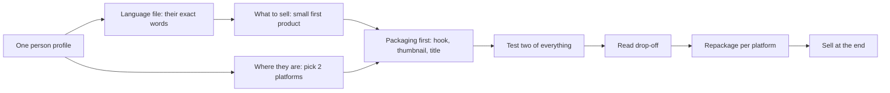

# Marketing - How to Sell a Product

> Organic product marketing process: profile one buyer, mine their exact words (Apify + Claude), pick 2 platforms, package first (hook/thumbnail), A/B two versions, read drop-off, repackage per platform, then sell.

---

## Overview

Building a product is easy now. Knowing who it is for, where those people spend time, and what makes them stop scrolling is the hard part. This is an organic-only process (the author says they have never run a paid ad). It starts from **one specific person**, and everything else follows from that choice: the platform, the words, the packaging, and often the product itself. The usual failure is picking the widest audience because it feels safer. A wide audience produces vague content, and vague content gets ignored even by the people who would have bought.

---

## Step 1 - Profile One Person, Not a Market

"Gamers" or "small business owners" is a category, and nobody can picture a category. Keep narrowing until you can see one person.

| Layer | What to capture |
|---|---|
| Demographics | Age, location, job, income, main device |
| Psychographics | Wants, fears, self-image, who they'd hate to be mistaken for, what they'd never admit about the problem |
| Day in the life | Hour by hour: when they open their phone, what else is on screen, what mood they are in |
| History | What they've tried and why it failed |
| Trust breakers | What would make them distrust a seller immediately |

**Look at real faces.** On Instagram, find an account whose audience matches, open 10-20 of its followers, and read their profiles and posts. You'll find where your assumptions were wrong (real age, other interests). Keep one Notion page per audience and update it as you learn.

> [!tip]
> The author's profiling prompt ends with an instruction worth reusing: *"tell me which parts of this you're confident about and which parts you're guessing, so I know what to go and verify."* Then check the guesses against subreddits, comments under the biggest videos, and follower lists.

---

## Step 2 - Steal Their Words (Highest Leverage)

Collect the exact sentences people write about the problem, typos included, from Reddit threads, YouTube comments and competitor reviews.

1. Connect the **Apify MCP** (`mcp.apify.com`) to Claude.
2. Ask in plain English, e.g. "find a Reddit scraper and pull every post and comment from r/[sub] for the last three months."
3. Feed the dump to Claude and ask for: phrases that repeat (quoted as written), what people have tried and why it failed, their own words for the emotion, requests nobody is meeting, what a product must do to make them happy, and what would make them ask for a refund.

The output is a **language file**. Write copy in their words, not yours. The complaint that keeps coming up is the product to build.

---

## Step 3 - What to Sell

Keep the first product small: a guide, a template pack, a short course or a simple tool. Its job is not to impress. Its job is to prove you read the audience correctly. If you already have a product, this step can show it is the wrong one.

---

## Step 4 - Where They Are

The platform follows from the person. Don't pick a platform you like and then look for an audience on it.

| Audience | Where |
|---|---|
| Young | TikTok, Instagram |
| Older | Facebook |
| Gamers | YouTube, Twitch |
| Professionals | LinkedIn, specific subreddits |
| Mid-problem, looking for a fix now | Reddit, Google search |

Ask Claude to list every community (subreddits, accounts, forums, Discords, channels, groups) with its rough size, how people talk there, and what gets removed. Have it rank them by free reach and **say which to ignore and why**, which is the more useful half. Pick **two** platforms and do them properly.

---

## Step 5 - Rules That Hold on Every Platform

- **Packaging is the product** as far as the viewer is concerned: the YouTube title and thumbnail, the TikTok first frame and first spoken line, the Reddit title. Decide the packaging first and build content that delivers on it. If you can't write a title you'd stop for, the idea is weak.
- **The click and the hold are one number.** A hook that overpromises gets the click and loses the viewer, and platforms read that as a bad experience. Reward the click fast.
- **Make it for one person.** The algorithm builds a picture of your audience and goes looking for more people like them. Scattered output blurs that picture. A consistent format matters more than a posting schedule.

### The first 2 seconds

- YouTube: about 2 seconds on the thumbnail before autoplay, then the first 5 seconds of video.
- TikTok: the first frame and roughly the first three words.
- The image should make the viewer ask a question they need answered. Example: a Valorant thumbnail with a character on an impossible wall above four unaware players got 1.6M views, and the same idea done again got 1.5M. **Write down the question before you design.**

### Titles and hooks

| Discovery mode | Title job |
|---|---|
| Feed | Finish the thought the image started without giving the answer. Never repeat the image in words |
| Search | Say plainly what it is, using the words the person typed |

The hook prompt asks for 15 hooks mixing: a specific number, a named mistake, a contradiction of something they believe, a result stated plainly, and a question they can't answer. Use audience words, check each hook against what the content can deliver, remove any that overpromise, and rank the rest. Structure: **hook (a promise) → story (the emotion) → payoff**.

> [!warning]
> A hook you can't pay off is worse than a weak hook. It burns the viewer and the platform notices.

---

## Step 6 - Test and Read the Data

- **Test two of everything:** two thumbnails per YouTube video, two hooks per TikTok/Instagram, and on Reddit the same post under two titles in two subreddits. Keep the three formats that work and keep testing new ones alongside them.
- **Read the drop-off curve:**

| Shape | Meaning | Fix |
|---|---|---|
| Cliff in the first seconds | The opening didn't deliver what the hook promised | Fix the opening, not the hook |
| Slow steady slide | Fine but too slow | Cut |
| Bump | People rewatched something | Do more of that |

Without a retention graph, compare two numbers: Reddit views vs comments, X impressions vs replies, email opens vs clicks. The first number measures packaging. The second measures whether the content delivered.

---

## Step 7 - One Idea, Every Platform

When something works, repackage it rather than cross-posting it. Keep the idea and the payoff, and rebuild the hook and format for each community. A YouTube title reads as clickbait on Reddit and gets removed.

> [!note]
> Recent shifts the author notes: thumbnails have become cleaner and on-image text does less than it used to. Short-form followers often don't watch your long videos.

---

## Step 8 - Sell

Give real value in the open, package it so people see it, and name what you sell at the end, after the content has already been useful. Selling something people want to people you understand is easy. Most people who can't sell never worked out who the product was for.

---

## What to Automate (After Doing It by Hand)

Once you know what a good output looks like, hand the repeated parts to an agent:

1. **Weekly language-file refresh:** new comments and threads from the target communities. The author calls this the most useful thing to automate.
2. **Niche performance watch:** top posts and formats that are gaining traction, so you catch a format early.
3. **Packaging batch:** two hooks and a few thumbnail concepts per upcoming piece, written against the profile.
4. **Monthly profile refresh:** the agent reports *what changed* rather than rewriting the profile.

You keep judging quality and replying to people.

---

## Related

[[Growth & Sales - Home]] | [[Growth - First Users Without Ad Spend]] | [[GTM - Agent-Driven GTM Machine]] | [[Sales - Outbound Outreach]] | [[AI Video - Faceless Videos with Claude Skills]]

---

## Sources

| Title | Publisher | Date | Links |
|---|---|---|---|
| how to actually sell a product (full guide) | @everestchris6 on X | 2026-08-10 | [Post](https://x.com/everestchris6/status/2086835132695265586) · [[ingested/clippings/how to actually sell a product (full guide)]] |

---

## Pending Review

> This page was created from a single non-authoritative source. To raise trust: find a primary source on this topic, or two independent corroborating sources, and re-ingest or enrich this page. Key claims to verify: (1) YouTube thumbnails get about 2 seconds before autoplay; (2) a consistent format matters more to algorithmic reach than posting cadence; (3) short-form audiences don't carry over to long-form.
