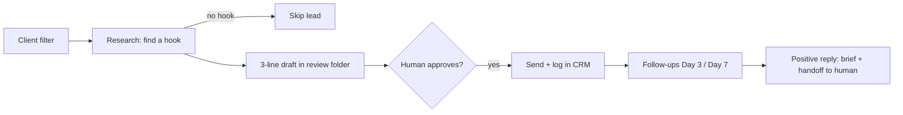

# Sales - Outbound Outreach

> Outbound prospecting playbook: LinkedIn account-safety limits, outreach tactics and benchmarks, plus an approval-gated AI agent pipeline (filter, research hook, 3-line draft, follow-up, handoff) replacing cold calls.

---

## Overview

Outbound works when every message is specific to the person and the account sending it stays healthy. Two practitioner sources cover this from two angles. One is a LinkedIn operator's list of platform limits and reply-rate benchmarks. The other is a design for an AI "outreach agent" that does research, drafting, follow-ups and logging while a human approves every send. They agree on the main point: low volume, high fit, a specific hook, a soft ask, and more than one channel.

---

## Core Principles

| Principle | What it means in practice |
|---|---|
| No hook, no message | If research finds nothing specific about the prospect (a launch, a post, a hiring signal, a visible gap), skip the lead |
| Quality over volume | 20 targeted messages with 3 real conversations beat 100 generic ones with 0 replies |
| Soft, micro-commitment asks | Offer a free resource or "want a quick example?" rather than a 30-min demo |
| Human approval on sends | Agents research and draft. A human sends, prices and books |
| Multi-channel | LinkedIn + email + phone is claimed to give a 287% engagement lift over one channel |
| Offer before automation | Automating volume without a clear offer and niche just produces more spam |

---

## LinkedIn: Account Health and Automation Safety

### Account health thresholds

| Metric | Target / limit |
|---|---|
| Social Selling Index (SSI) | Keep above 70. Below that, the account gets flagged faster |
| Pending connection requests | Under 700 (called the #1 spam signal) |
| Weekly connection requests | 100-150 standard; 200-250 for high-SSI Sales Navigator |
| Acceptance rate | 30%+ target; below 20% triggers automatic restriction |
| Withdraw stale requests | Every 2-4 weeks |
| New account warmup | 6-8 weeks, starting at 5-10 manual requests/day |
| Connection note length | Under 200 characters |

> [!warning]
> After a ban, never open a new account from the same IP. The author says LinkedIn tracks device fingerprints. The author also treats Sales Navigator as required for serious outbound, because free accounts are limited by design.

### Automation safety

- Avoid cheap (<$50/mo) browser-based automation tools.
- Use anti-detect browsers (Multilogin, GoLogin) only if you run several accounts.
- Run automation in the prospect's local business hours. Activity at 3 AM gets flagged.
- Use one automation tool per account. Two tools create conflicting sessions.
- Turn off Grammarly and ad-blockers on LinkedIn while automating.

---

## LinkedIn: Tactics and Benchmarks

### Reach without spending connection requests

- **Event attendee loophole:** message attendees through the event's "Networking" tab without connecting first.
- **Open Profile Premium users:** message them for free. The author claims 800 free InMails/month without using credits.
- **LinkedIn Groups:** message fellow members directly.
- **Viral post engagers:** retarget people who engaged with industry influencers' posts. They are already interested in the topic.

### Copy and timing

| Lever | Claimed effect |
|---|---|
| Blank connection requests (broad campaigns) | 55-68% acceptance vs ~30% for templated notes |
| 30-45 second voice notes | 30-40% reply-rate boost (pattern interrupt) |
| Mid-level influencers (Product, Ops, HR) | 10-12% reply vs ~7% for C-suite |
| New job starters (<90 days in role) | 3-4x higher response rates |
| Tuesday sends | Best day (6.9% reply); avoid Saturdays |
| No external URLs in first message | Avoids a claimed 25-40% reach reduction |
| InMail body under 400 characters | ~22% better performance |
| InMail subject 25-40 characters | Better mobile open rates |
| Headline as value prop ("I help X do Y") | Higher acceptance than a bare job title |

> [!tip]
> The author's benchmark for "high performance" is a 48% qualified/positive reply rate. Treat it as an upper bound, not a normal result.

---

## AI Outreach Agent (Replacing Cold Calling)

Cold calling reaches people who have no context, leaves nothing reusable behind, and breaks deep work. The alternative is an agent that runs a pipeline and gives you warmer conversations, while you keep judgment, pricing and the call itself.

### Agent job description

| Owns | Never without approval (at first) | Delivers every morning |
|---|---|---|
| Daily prospecting in a defined niche | Sending emails or messages | Who was researched |
| Small batches of high-fit leads | Booking calls or demos | What is ready to send |
| Short, specific drafts | Pricing, contracts, legal terms | Who replied |
| Scheduled follow-up drafts | | Suggested next steps |
| Logging replies and preparing context | | |

### The pipeline

1. **Define the client filter.** Industry, size (team, revenue), role, location, and one clear problem you solve (e.g. "no booking button", "bad reviews", "slow lead response"). This becomes the agent's first rule.
2. **Research before messaging.** Check recent posts, the website, the product and hiring signals. Good hooks: "Your Google rating is 4.7 but you have no booking button", "You're hiring for [role] while your site looks like 2015".
3. **Draft, don't blast.** Three lines: a specific observation, one outcome in their language, and a soft ask ("Worth a 10-minute chat?"). The agent writes 10-20 drafts/day and you approve 5-10.
4. **Follow up on a schedule.** Day 0 first touch, Day 3 a different angle or a small asset (case study, example), Day 7 a final nudge ("I'll circle back next quarter"). Stop after that, and never chase a "no".
5. **Hand off.** When someone replies with interest, the agent gives you a 3-line prospect summary, the thread, a suggested next step (15-min call, audit, proposal) and red flags (budget, timeline, decision-makers).

### Guardrails and starting limits

- Don't send anything on day one. Review every draft for the first week.
- Never buy lists. Never add the same person twice.
- If a reply mentions money, legal or contracts, the agent stops and asks you.
- Starting volume: 10-20 prospects researched/day, 5-10 first touches/day, at most 1-2 follow-ups per prospect.

### 7-day rollout

1. **Day 1:** Write the ideal client paragraph, a one-sentence offer, and hard stop rules.
2. **Day 2:** Connect only email, a CRM or sheet, and a calendar booking link.
3. **Day 3:** Research-only run on 20 leads. Judge the hook quality and tighten the filter.
4. **Days 4-5:** Approve and send 5-10 drafts, then track opens and replies.
5. **Day 6:** Add 1-2 follow-up drafts per sent email.
6. **Day 7:** Review open, reply and positive-reply rates. Adjust niche, hooks and style, then decide whether to raise volume a little.

> [!tip]
> Measure replies from the right people, not activity. Generic "just circling back" copy fits anyone, so it lands with no one.

---

## Tension Between the Sources

- **Personalised notes vs blank requests.** The agent approach says every message needs a specific hook. The LinkedIn post says *blank* connection requests get higher acceptance on broad campaigns. They fit together: the blank request only opens the connection, and the specific hook belongs in the first real message.
- **Automation risk.** The LinkedIn post assumes automation (with safety rules). Other sources in this domain say to send DMs by hand because platforms ban automated messaging (see [[GTM - Agent-Driven GTM Machine]]).

---

## Related

[[Growth & Sales - Home]] | [[GTM - Agent-Driven GTM Machine]] | [[Growth - First Users Without Ad Spend]] | [[Marketing - How to Sell a Product]] | [[AI Agents - Multi-Agent Orchestration]]

---

## Sources

| Title | Publisher | Date | Links |
|---|---|---|---|
| 12 million leads, 15,000+ meetings - 2026 LinkedIn outreach holy grail | LinkedIn post (author not captured; promotes Valley) | 2026-07-30 (clipped) | [Post](https://www.linkedin.com/feed/) · [[ingested/clippings/12 million leads, 15,000+ meetings - here's my brutally honest 2026 LinkedIn outreach holy grail]] |
| STOP COLD CALLING! This AI Agent lands clients fast | @KanikaBK on X | 2026-08-21 | [Post](https://x.com/KanikaBK/status/2090709156789678484) · [[ingested/clippings/STOP COLD CALLING! This AI Agent lands clients fast]] |

---

## Pending Review

> This page was created from two non-authoritative practitioner sources (a vendor-promotional LinkedIn post and an X thread). To raise trust: find a primary source on LinkedIn limits, or two independent corroborating sources, and re-ingest or enrich this page. Key claims to verify: (1) the 700 pending-request and 20% acceptance-rate restriction thresholds; (2) the 55-68% acceptance for blank connection requests vs ~30% for notes; (3) the 287% multi-channel engagement lift.
